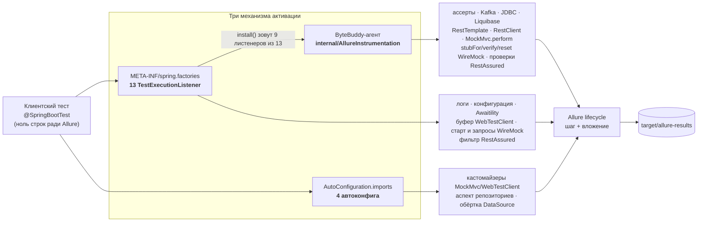

# Архитектура: как это устроено и куда смотреть

Этот документ написан для того, кто ревьюит **код и его архитектуру**, а не пользуется
библиотекой; если ты просто её подключаешь, читай `README.md`. Он должен дать достаточно,
чтобы спорить по существу, не читая все 68 классов.

Сам документ читается минут пятнадцать. Маршрут по коду из §2 занимает 1301 строку:
пробежать его глазами можно за полчаса, и картина уже складывается, а читать вдумчиво,
вместе с правилами из §7, придётся часа полтора.

Все числа посчитаны по репозиторию, и там, где число легко проверить самому, рядом стоит
команда. Часть из них пересчитывает `unit/ArchitectureDocTest`: если добавить класс или
модуль и не поправить текст, сборка покраснеет и покажет, какое именно число разошлось.

---

## 1. Что делает библиотека

Библиотека делает Allure-отчёт для Spring-тестов **без единой строки в клиентских тестах**:
достаточно положить jar на test-classpath, и он сам цепляется к MockMvc, RestAssured,
репозиториям, SQL, Kafka, WireMock, ассертам, логам и конфигурации. Единственное
исключение — **Mockito: его включают вручную**. SPI-файла MockMaker в jar нет, клиентский
проект добавляет его сам, иначе библиотека навязывала бы свой MockMaker всем и
конфликтовала бы с чужим.

Почти вся форма кода выросла из двух принципов:

1. **Ноль кода в клиентском проекте.** Никаких аннотаций, базовых классов и `@ExtendWith`.
   Отсюда три механизма активации (§4) и резолв переехавших типов по имени (§7).
2. **Отчёт не имеет права менять поведение приложения.** Ни исключением, ни лишним запросом
   в БД, ни телом ответа, которое читается только один раз. Поэтому в коде столько гейтов,
   ленивые JPA-связи обходит отдельная проверка, а `try/catch` стоит на каждом рендере
   значения: в `clean`, `render`, `describeResponse`. В `describeEntity` свой `catch`
   стоит на каждом поле.

В `src/main` лежит **69 классов / 6777 строк** в 20 пакетах, в `src/test` — **113 классов**
и 526 тестов. У клиентского проекта появляется ровно одна зависимость в `compile`
(`allure-java-commons`), остальные 23 помечены `provided`/`optional`: модуль включается,
только если технология уже есть в тестах.

```bash
find src/main/java -name '*.java' | wc -l && find src/main/java -name '*.java' -exec cat {} + | wc -l
mvn clean test        # число тестов
```

⚠️ Числа расходятся с кодом при каждом коммите. Единственное, чего `ArchitectureDocTest`
не сторожит, это количество тестов: точное значение известно только после прогона,
и печатает его команда выше.

---

## 2. В каком порядке читать код

Шесть шагов, восемь файлов, читать по порядку. В последней колонке стоит реальный объём,
чтобы каждый сам прикинул время: скажем, у `AllureAdviceSupport` из 273 строк 124 занимают
комментарии.

| # | файл | что смотреть | строк |
|---|---|---|---|
| 1 | `internal/AllureInstrumentation` | единственная точка установки агента: `retransform`, аварийный выключатель, поведение при сбое (matcher и advice приносит каждый модуль сам) | 139 |
| 2 | `internal/AllureAdviceSupport` | рендер значений: три функции для трёх мест отчёта; почему их три и что ломается при путанице | 273 |
| 3 | `assertion/AllureAssertionsListener` + `assertion/internal/AllureAssertJInstrumentation` | типовой байткод-модуль целиком: гард присутствия → install → advice → шаг | 64 + 157 |
| 4 | `rest/AllureMockMvcAutoConfiguration` + `internal/MovedCustomizerRegistrar` | второй механизм активации и приём «тип резолвится по имени», которым держится кросс-версионность | 57 + 135 |
| 5 | `data/internal/AllureRepositoryAspect` | Spring AOP, рендер сущностей, защита от побочных эффектов | 349 |
| 6 | `internal/InstrumentationDiagnostics` | как видно, что перехват сломался: счётчики трансформаций и сбоев, выборка имён типов (дамп и гейт — на стороне тестов, см. §10) | 127 |

Итого 1301 строка. Если времени мало, хватит шагов 1, 2 и 3: это 633 строки, и они дают
механику целиком, а остальные байткод-модули повторяют шаблон из пункта 3. Карту всех
точек входа смотри в §5.

---

## 3. Как тест попадает в отчёт



⚠️ **Четыре модуля стоят на схеме дважды, и это не ошибка: у них работают оба механизма.**
У MockMvc это кастомайзер из автоконфигурации и байткод на `perform`. У WebTestClient
кастомайзер снимает обмен, а листенер его проигрывает. У WireMock работают листенер на
старте сервера и запросах и байткод на `stubFor`/`verify`/`reset`. У RestAssured — фильтр
в `RestAssured.filters` и байткод на проверках `.then()`. Точный механизм по каждой
точке входа указан в §5.

Байткод ставят только листенеры: `install()` зовут 9 из 13, у автоконфигураций такого пути
нет вовсе. То есть листенер здесь не только «сделать что-то на каждый тест», но и точка
установки байткода, и потому модуль вроде MockMvc заводится сразу с двух сторон.

**На входе в отчёт стоит гейт по активному тест-кейсу.** Поэтому перехват, который сработал
во время старта контекста или в чужом потоке, молчит и не сыплет ошибками «no test case
running». Выглядит этот гейт в разных модулях по-разному, разбор — в §7, правило 1.

---

## 4. Как выбирается механизм активации

Механизм выбирается по одному вопросу: есть ли у нас точка входа. Какой модуль чем
активируется, написано в §5, а здесь только правило и его цена.

| механизм | когда выбираем | чем платим |
|---|---|---|
| `TestExecutionListener` (`spring.factories`) | нужно действие **на каждый тест** или установка чего-либо перед первым классом | листенер регистрируется всегда, поэтому модуль обязан сам проверить, есть ли его технология (`ClassPresence`) |
| Spring Boot auto-configuration (`AutoConfiguration.imports`) | наше расширение должно стать **бином** в контексте клиентского проекта | работает только там, где включена автоконфигурация; `@ConditionalOnClass` читается ASM-ом — если класс уехал, модуль молча не применится |
| Байткод (ByteBuddy) | у чужой библиотеки **нет публичной точки расширения** для нужного места | привязка к чужим сигнатурам, иногда к внутренним классам (§9); сбой трансформации не виден из теста — нужна отдельная диагностика (§10) |

Оправдан ли третий механизм вообще — вопрос 1 из §12.

---

## 5. Карта модулей

13 листенеров из `META-INF/spring.factories` дают точку входа на каждый тест:

| точка входа | что ловит | механизм | нет технологии в клиентском проекте |
|---|---|---|---|
| `logs/AllureApplicationLogsListener` | логи приложения за тест | аппендер Logback за гейтом `ClassPresence` + `instanceof` | молчит (Log4j2/JUL — не падает) |
| `config/AllureConfigurationListener` | снимок `Environment` перед тестом | Spring API | всегда применим |
| `rest/AllureRestAssuredListener` | HTTP через глобальный `given()` и проверки `.then()` | фильтр в `RestAssured.filters` (ставится в `beforeTestExecution`) + байткод на проверках `ValidatableResponseOptionsImpl` | молчит |
| `rest/AllureMockMvcListener` | `MockMvc.perform` | байткод | молчит |
| `rest/AllureRestTemplateListener` | вызовы `RestTemplate` | байткод (интерсептор, см. §9) | молчит |
| `rest/AllureRestClientListener` | вызовы `RestClient` | байткод (внутренний класс Spring, см. §9) | молчит |
| `rest/AllureWebTestClientListener` | обмены `WebTestClient`, где виден только статус | повтор буфера, снятого фильтром обмена | молчит |
| `wiremock/AllureWireMockTestListener` | старт сервера, запросы, near-miss, сценарии | рефлексивный поиск `WireMockServer` в полях тест-класса + request listener; дополнительно байткод на `stubFor`/`verify`/`reset` — у них listener-хука нет | молчит |
| `assertion/AllureAssertionsListener` | AssertJ, Hamcrest, JUnit Jupiter, Spring `AssertionErrors` | байткод | молчит |
| `kafka/AllureKafkaListener` | `producer.send`, `consumer.poll` | байткод | молчит |
| `data/AllureJdbcListener` | `JdbcTemplate`, `NamedParameterJdbcTemplate` | байткод | молчит |
| `liquibase/AllureLiquibaseListener` | применение changeset'ов + снимок стартовой схемы | байткод по `ChangeSet.execute` | молчит |
| `awaitility/AllureAwaitilityListener` | завершённые `await()…until()` | официальный SPI Awaitility | молчит |

4 автоконфига из `AutoConfiguration.imports` становятся бинами:

| автоконфиг | что регистрирует | тонкость |
|---|---|---|
| `rest/AllureMockMvcAutoConfiguration` | кастомайзер MockMvc, который вешает `AllureMockMvcResultHandler` на каждый собираемый `MockMvc` | тип кастомайзера переехал между Boot 3 и 4 — резолвится по имени, бин регистрируется программно |
| `rest/AllureWebTestClientAutoConfiguration` | кастомайзер WebTestClient | то же; у WebTestClient нет подстраховки байткодом — потеряется кастомайзер, потеряются и все шаги |
| `data/AllureDataJpaAutoConfiguration` | аспект репозиториев (Spring AOP) и `@EnableAspectJAutoProxy` в контексте клиентского проекта | pointcut задан строкой (spring-data нет в compile-classpath); `proxyTargetClass` намеренно не выставляется — режим проксирования остаётся тот, что был в проекте |
| `data/AllureDataSourceAutoConfiguration` | `BeanPostProcessor`, заводящий `getConnection` бина `DataSource` в datasource-proxy | реальный SQL вкладывается внутрь шага вызова репозитория; бин остаётся объектом своего класса (подкласс через Spring AOP), иначе ломается инъекция по конкретному типу — issue #54 |

```bash
cat src/main/resources/META-INF/spring.factories src/main/resources/META-INF/spring/*.imports
```

Колонка «нет технологии» проверяется тестом `unit/ListenerDegradationTest`: каждый листенер
из `spring.factories` покрыт сценарием «библиотеки нет».

### Как добавить новый модуль

Чтобы добавить в эту карту строку, надо пройти семь шагов. Все семь видны на самом маленьком
модуле, `awaitility/AllureAwaitilityListener`:

1. класс листенера (или автоконфига) в корне пакета модуля;
2. строка в `META-INF/spring.factories`;
3. гард присутствия технологии — `ClassPresence.isPresent("org.awaitility.Awaitility")`;
4. идемпотентная установка — `INSTALLED.compareAndSet(false, true)`;
5. канарейка в `canary/InstrumentationApiCanaryTest` на каждое допущение о чужом API;
6. новый вид шага в эталоне `src/test/inventory/report-inventory.txt` — иначе его исчезновение
   никто не заметит;
7. сценарий «библиотеки нет» в `unit/ListenerDegradationTest`.

Пакеты разложены так: в корне модуля лежит то, что видит Spring (листенер, автоконфиг),
а в его `internal` — реализация, которую снаружи трогать незачем. Свой `internal` есть
у девяти модулей из десяти, у `config` он не понадобился.

---

## 6. Что лежит в `internal/` (12 классов + `package-info`)

Публичного API тут нет: это внутренний код, и `package-info` это фиксирует.

| класс | зачем |
|---|---|
| `AllureInstrumentation` | `retransform(matcher, transformer)` + аварийный выключатель `-Dallure.spring.instrumentation=off`. Единственное место, где вызывается `ByteBuddyAgent.install()` и строится `AgentBuilder`; сам byte-buddy импортируют ещё 16 файлов — модули пишут свои matcher и advice |
| `AllureAdviceSupport` | рендер значений и создание шага; вызывается из inline-advice, поэтому `public static` |
| `AllureJson` | отступы в JSON-вложениях без JSON-зависимости и без пересериализации |
| `ClassPresence` / `ByteBuddyPresence` / `ByteBuddyClassFormat` | гарды: есть ли технология, есть ли byte-buddy, знает ли он формат class-файлов этой JVM |
| `MovedTypeNames` / `MovedCustomizerRegistrar` | типы, переехавшие между мажорами Boot: имена строкой + программная регистрация бина |
| `JpaLaziness` | распознаёт незагруженную ленивую связь JPA, не трогая её |
| `InstrumentationDiagnostics` / `ActivationDiagnostics` | видно ли, что перехват сломался или что модуль молча не активировался |
| `AllureInstrumentationLogger` | единый канал WARNING для байткод-модулей |

---

## 7. Правила, общие для всех модулей

Их шесть, и в тексте на них ссылаются по номеру.

1. **Гейт по активному тест-кейсу.** Если активного Allure-кейса нет, в отчёт не пишем:
   перехват работает на всю JVM и иначе сыпал бы шаги мимо тестов. Проверяют это
   по-разному. Байткод-модули, фильтры и интерсепторы спрашивают явно, через
   `AllureAdviceSupport.step` или свой `active()`. А листенеры конфигурации и логов гейта
   не содержат вовсе: Spring зовёт их внутри жизненного цикла теста, так что кейс
   есть по построению.
2. **Три рендера значения, а не один** (`AllureAdviceSupport`): `safe` — ИМЯ шага (одна строка,
   лимит 500), `safeValue` — ЗНАЧЕНИЕ во вложении (многострочно, лимит 500 000 и обрезка
   подписана в тексте), `render` — СЫРОЕ тело, без чистки. Если их перепутать, отчёт
   испортится молча: имя, mime и «непусто» останутся прежними.
3. **Никогда не бросать исключение в клиентский код.** Любой сбой перехвата даёт WARNING
   и неполный отчёт. Тонкое место — аспект репозиториев: там рендер ответа вычисляется
   как аргумент `finish(...)`, то есть внутри `try`, чей `catch` пробрасывает исключение
   наружу. Поэтому рендер обёрнут в `describeResponse`: иначе его сбой ронял бы вызов
   репозитория, который уже прошёл успешно, и врал бы статусом BROKEN.
4. **Гард перед install.** Листенер регистрируется всегда, поэтому модуль сам проверяет,
   есть ли чужая библиотека: без такой проверки её отсутствие роняло бы весь прогон.
   Защищаются двумя способами. Большинство модулей спрашивают `ClassPresence.isPresent(…)`,
   а перед байткодом ещё и `ByteBuddyPresence`. Kafka обходится без первой проверки: её
   матчер задан именем класса и без kafka-clients просто ничего не находит, а advice
   со ссылками на типы Kafka линкуется только при совпадении.
5. **Переехавшие типы — по имени.** Компиляция против типа, который переезжает между мажорами
   Boot, молча выключала бы модуль там, где мажор другой.
6. **Идемпотентность установки.** У каждого из 13 модулей-инструментаторов свой
   `AtomicBoolean`-гард, чтобы install случился ровно один раз на JVM. У общей базы
   `AllureInstrumentation` гарда нет намеренно: сама она ничего не ставит. Второй install
   навесил бы вторую копию advice и задвоил шаги во всём прогоне.

---

## 8. Что живёт дольше одного теста

Здесь перечислены типовые виды состояния, которое живёт дольше одного теста. Список
неполный: полный собирает команда под таблицей.

| состояние | где | живёт | зачем такое |
|---|---|---|---|
| `AtomicBoolean INSTALLED` (в каждом байткод-модуле) | `*Instrumentation` | до конца JVM | идемпотентность; ⚠️ обратно не выключается — сценария «включить снова» нет |
| `Set<MvcResult>` / `Set<WireMockServer>` на `WeakHashMap` | `AllureMockMvcResultHandler`, `AllureWireMockTestListener` | пока жив ключ | дедуп «уже залогировано», без удержания чужих объектов |
| `List<String> STARTUP_SNAPSHOT` | `AllureLiquibaseInstrumentation` | до конца JVM | снимок стартовой схемы повторяется в начале каждого теста; ⚠️ JVM-широкий: два разных контекста БД в одной JVM накапливаются |
| `ThreadLocal` счётчика глубины | AssertJ, Spring-ассерты, валидация RestAssured, `JdbcTemplate` | на поток | перехваченные методы делегируют друг другу (`assertNull` → `assertTrue` → `fail`; `queryForObject` → `query`); без счётчика один вызов дал бы несколько шагов |
| `ThreadLocal` журнала сброса | WireMock-reset | на поток | near-miss и сценарии снимаются до того, как `reset` их сотрёт |
| `ClassValue` кэш распознавания | `JpaLaziness` | вместе с классом | не удерживает чужие загрузчики |

```bash
# полный список общего состояния (вывод не усекать)
grep -rn "ThreadLocal<\|static final \(Map\|Set\|List\|Atomic\|ClassValue\)" src/main/java
```

Параллельный запуск в потоках одной JVM стоит у нас в низком приоритете: в клиентских
проектах он не планируется. Списки «что работает, а что нет» лежат в README, раздел
«Параллельный запуск».

---

## 9. Где самый большой риск

Привязки к тому, что автор чужой библиотеки менять не обещал:

| привязка | чей внутренний код | чем стережётся |
|---|---|---|
| `DefaultRestClientBuilder.build()` | Spring, package-private | канарейка `canary/InstrumentationApiCanaryTest` |
| `setInterceptors`, объявленный в `InterceptingHttpAccessor` (доставка интерсептора `RestTemplate`) | Spring, иерархия классов | канарейка: ByteBuddy вплетает только в объявителя, переезд метода по иерархии сделал бы перехват тихим no-op |
| `ValidatableResponseOptionsImpl` + список методов проверок | RestAssured `internal` | канарейка (класс + каждый метод) |
| `InlineByteBuddyMockMaker` | Mockito `internal` | канарейка + opt-in SPI (файл не едет в jar) |
| приватное поле `AbstractAssert.actual` | AssertJ | канарейка + ADR 0001 |
| приватные поля режимов verify | Mockito `internal` | канарейка на каждое поле |
| `ChangeSet.execute(3-арг)` | Liquibase | канарейка |
| имена интерфейсов ленивости JPA | Hibernate / EclipseLink | канарейка читает константы из `JpaLaziness`, а не свои копии |

Матчеры бывают двух видов, и ломаются они по-разному:

- **строковые** (`named("send")`, `named("perform")`) — 11 файлов; компилятор их не проверяет,
  ломает переименование метода в чужой библиотеке;
- **типизированный** — ровно один: AssertJ матчит `isSubTypeOf(AbstractAssert.class)` и берёт
  методы по признакам (`isPublic`, `not(isConstructor)`), без имён вовсе. Компилятор тип
  проверяет, зато ломает изменение иерархии и приватного поля `actual` — отсюда отдельный
  разбор в `docs/adr/0001-assertj-instrumentation.md`.

Канарейка нужна и тем и другим, но ловит она разное. Стоит ли вообще держать такие
точки — вопрос 2 из §12.

---

## 10. Что уже проверено

- **526 тестов** в двух уровнях. Уровень A — детерминированные проверки содержимого отчёта
  через in-memory Allure, уровень B — живые `*ReportIT`, которые читают реально записанные
  `allure-results`.
- **Инвентарь видов шагов и вложений** — эталон `src/test/inventory/report-inventory.txt`,
  сверяется вторым прогоном surefire: исчезновение вида = красная сборка.
- **Диагностика сбоев перехвата** — счётчики в `internal/InstrumentationDiagnostics`; дамп
  пишет `inventory/InstrumentationDiagnosticsDump`, краснеет `inventory/InstrumentationFailures`.
- **Матрица совместимости** — базовая версия, Allure 2.20 и Allure 2.35.4 зелёные.
- **A/B на трёх клиентских сервисах** в трёх режимах: подключение библиотеки не меняет
  ни исходов тестов, ни наблюдаемого поведения (`docs/consumer-affects.md`).
- **Повторяемость** — `scripts/repeat.sh 5`, зависимости от порядка тест-классов не видно.

---

## 11. Чего не хватает

- **Нижняя граница Spring Boot сборкой не проверяется**: профиль `compat-boot-min` не
  собирается после перехода на Boot 4.1 (`docs/compat-matrix.md`).
- **CI нет**: все проверки запускает человек командой. Два workflow готовы, но токену
  не хватает прав.
- **Mockito — opt-in**: SPI-файл MockMaker лежит в тестовых ресурсах, а не в jar, иначе
  навязывался бы всем и конфликтовал с чужим MockMaker.
- **Реактивная БД (R2DBC)** в отчёт не попадает: аспект рассчитан на синхронный стек.
- **Ленивость вне Hibernate/EclipseLink** не распознаётся (OpenJPA): значение будет прочитано,
  но вызов приложения не упадёт.
- **Инструменты ревью надо собрать перед первым запуском** (`cd tools && mvn -q package`):
  разбор данных переехал с python3 на Java. Это отдельный проект, не модуль библиотеки, —
  собирается, даже когда библиотека не компилируется (`docs/adr/0003-review-tooling-on-java.md`).

---

## 12. Шесть вопросов лиду

1. **Байткод там, где нет hook'а** — приемлемая цена или архитектурная ошибка? Если ошибка,
   то что вместо: отказ от этих модулей или свой SPI-слой поверх?
2. **Привязка к внутренним классам** (`DefaultRestClientBuilder`, `ValidatableResponseOptionsImpl`,
   `InlineByteBuddyMockMaker`): канарейки достаточно, или такие точки не стоит поддерживать вовсе?
3. **Статика, живущая до конца JVM** — гарды установки и JVM-широкий буфер Liquibase. Как бы
   ты это спроектировал, чтобы состояние не переживало Spring-контекст?
4. **Границы модулей.** 20 пакетов; у девяти модулей из десяти свой `internal` (кроме `config`).
   Где граница проведена неверно и что стоит собрать вместе — или наоборот разнести?
5. **Читаемость с нуля.** Пройди маршрут из §2 и скажи, сколько, по-твоему, займёт вход
   нового человека и что мешало больше всего.
6. **Что сделано «слишком умно»** и должно быть проще — даже ценой функциональности отчёта.

Критерии, по которым проект сам себя проверяет, собраны в `docs/java-code-standard.md`,
а решения по самым спорным местам лежат в `docs/adr/`.
