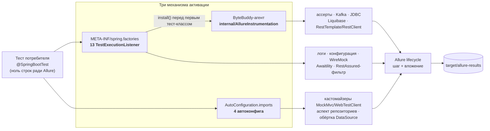

# Архитектура: как это устроено и куда смотреть

Документ для того, кто ревьюит **код и его архитектуру**, а не пользуется библиотекой
(пользователю — `README.md`). Задача — довести до состояния, в котором можно спорить
по существу, не читая все 68 классов.

Честно про время: сам документ — минут пятнадцать. Маршрут по коду (§2) — 1301 строка;
беглым проходом это полчаса и даёт картину, вдумчивое чтение с инвариантами — часа полтора.

Числа в документе сняты командами с репозитория; там, где число легко проверить самому,
команда стоит рядом.

---

## 1. Что это и на чём стоит

Библиотека даёт Allure-отчёт для Spring-тестов **без единой строки в тестах потребителя**:
jar на test-classpath сам вцепляется в MockMvc, RestAssured, репозитории, SQL, Kafka, WireMock,
ассерты, логи и конфигурацию. Единственное исключение — **Mockito: он opt-in**, SPI-файла
MockMaker в jar нет, потребитель добавляет его сам (иначе библиотека навязывала бы свой
MockMaker всем и конфликтовала бы с чужим).

Два принципа, из которых следует почти вся форма кода:

1. **Ноль кода у потребителя.** Никаких аннотаций, базовых классов и `@ExtendWith`. Отсюда три
   механизма активации (§4) и резолв переехавших типов по имени (§7).
2. **Отчёт не имеет права менять поведение приложения.** Ни исключением, ни лишним запросом
   в БД, ни вычитанным одноразовым телом ответа. Отсюда гейты, страж ленивых JPA-связей
   и `try/catch` на каждом рендере значения: `clean`, `render`, `describeResponse`
   и отдельный `catch` на каждое поле в `describeEntity`.

Масштаб: `src/main` — **68 классов / 6346 строк**, 20 пакетов; `src/test` — **103 класса**,
489 тестов. Зависимость у потребителя ровно одна в `compile` (`allure-java-commons`),
остальные 22 — `provided`/`optional`, то есть модуль включается, только если технология
уже есть в тестах.

```bash
find src/main/java -name '*.java' | wc -l && find src/main/java -name '*.java' -exec cat {} + | wc -l
mvn clean test        # число тестов
```

⚠️ Числа сняты на ветке `docs/architecture` (день создания документа) — они дрейфуют.
Команды рядом именно для того, чтобы не верить на слово.

---

## 2. Маршрут чтения

Шесть шагов (восемь файлов) по порядку. Этого хватает, чтобы понять остальное: дальше вариации.
В колонке — реальный объём, чтобы время каждый оценил сам: у `AllureAdviceSupport` из 273 строк
124 комментария, и в них половина смысла.

| # | файл | что смотреть | строк |
|---|---|---|---|
| 1 | `internal/AllureInstrumentation` | единственная точка УСТАНОВКИ агента: `retransform`, аварийный выключатель, поведение при сбое (matcher и advice приносит каждый модуль сам) | 139 |
| 2 | `internal/AllureAdviceSupport` | рендер значений: ТРИ функции для трёх мест отчёта; почему их три и что ломается при путанице | 273 |
| 3 | `assertion/AllureAssertionsListener` + `assertion/internal/AllureAssertJInstrumentation` | типовой байткод-модуль целиком: гард присутствия → install → advice → шаг | 64 + 157 |
| 4 | `rest/AllureMockMvcAutoConfiguration` + `internal/MovedCustomizerRegistrar` | второй механизм активации и приём «тип резолвится по имени», которым держится кросс-версионность | 57 + 135 |
| 5 | `data/internal/AllureRepositoryAspect` | самый «прикладной» модуль: Spring AOP, рендер сущностей, защита от побочных эффектов | 349 |
| 6 | `internal/InstrumentationDiagnostics` | как видно, что перехват сломался: счётчики трансформаций и сбоев, выборка имён типов (дамп и гейт — на стороне тестов, см. §10) | 127 |

Итого 1301 строка. Если времени мало — шаги 1, 2 и 3 (633 строки) дают механику целиком,
остальное вариации на ту же тему.

Дальше — частности: остальные байткод-модули повторяют шаблон из п. 3, а карта всех точек
входа — в §5.

---

## 3. Поток управления



⚠️ **На схеме модуль стоит под одним механизмом, в коде бывает два.** MockMvc: кастомайзер
из автоконфигурации плюс байткод на `perform`. WireMock: листенер плюс байткод на
`stubFor`/`verify`/`reset`. Точный механизм по каждой точке входа — в §5.

**На входе в отчёт стоит гейт по активному тест-кейсу** — поэтому перехват, срабатывающий
во время старта контекста или в чужом потоке, молчит, а не сыпет «no test case running».
Выглядит он в разных модулях по-разному, разбор — в §7, инвариант 1.

---

## 4. Почему механизмов активации три

Механизм определяется одним вопросом: где у нас есть точка входа. Какой модуль чем
активируется — в §5, здесь только правило и его цена.

| механизм | когда выбираем | чем платим |
|---|---|---|
| `TestExecutionListener` (`spring.factories`) | нужно действие **на каждый тест** или установка чего-либо перед первым классом | листенер регистрируется ВСЕГДА, поэтому модуль обязан сам проверить, есть ли его технология (`ClassPresence`) |
| Spring Boot auto-configuration (`AutoConfiguration.imports`) | наше расширение должно стать **бином** в контексте потребителя | работает только там, где включена автоконфигурация; `@ConditionalOnClass` читается ASM-ом — если класс уехал, модуль молча не применится |
| Байткод (ByteBuddy) | у чужой библиотеки **нет публичной точки расширения** для нужного места | привязка к чужим сигнатурам, иногда к внутренним классам (§9); сбой трансформации не виден из теста — нужна отдельная диагностика (§10) |

Оправдан ли третий механизм вообще — вопрос 1 из §12.

---

## 5. Карта модулей

13 листенеров (`META-INF/spring.factories`) — точка входа на каждый тест:

| точка входа | что ловит | механизм | нет технологии у потребителя |
|---|---|---|---|
| `logs/AllureApplicationLogsListener` | логи приложения за тест | аппендер Logback за гейтом `ClassPresence` + `instanceof` | молчит (Log4j2/JUL — не падает) |
| `config/AllureConfigurationListener` | срез `Environment` перед тестом | Spring API | всегда применим |
| `rest/AllureRestAssuredListener` | HTTP через глобальный `given()` | фильтр в `RestAssured.filters` | молчит |
| `rest/AllureMockMvcListener` | `MockMvc.perform` | байткод | молчит |
| `rest/AllureRestTemplateListener` | вызовы `RestTemplate` | байткод (интерсептор, см. §9) | молчит |
| `rest/AllureRestClientListener` | вызовы `RestClient` | байткод (внутренний класс Spring, см. §9) | молчит |
| `rest/AllureWebTestClientListener` | статус-онли обмены `WebTestClient` | проигрывание буфера, снятого фильтром обмена | молчит |
| `wiremock/AllureWireMockTestListener` | старт сервера, запросы, near-miss, сценарии | рефлексивный поиск `WireMockServer` в полях тест-класса + request listener; ДОПОЛНИТЕЛЬНО байткод на `stubFor`/`verify`/`reset` — у них listener-хука нет | молчит |
| `assertion/AllureAssertionsListener` | AssertJ, Hamcrest, JUnit Jupiter, Spring `AssertionErrors` | байткод | молчит |
| `kafka/AllureKafkaListener` | `producer.send`, `consumer.poll` | байткод | молчит |
| `data/AllureJdbcListener` | `JdbcTemplate`, `NamedParameterJdbcTemplate` | байткод | молчит |
| `liquibase/AllureLiquibaseListener` | применение changeset'ов + снимок стартовой схемы | байткод по `ChangeSet.execute` | молчит |
| `awaitility/AllureAwaitilityListener` | завершённые `await()…until()` | официальный SPI Awaitility | молчит |

4 автоконфига (`AutoConfiguration.imports`) — то, что становится бином:

| автоконфиг | что регистрирует | тонкость |
|---|---|---|
| `rest/AllureMockMvcAutoConfiguration` | кастомайзер MockMvc, который вешает `AllureMockMvcResultHandler` на каждый собираемый `MockMvc` | тип кастомайзера ПЕРЕЕХАЛ между Boot 3 и 4 — резолвится по имени, бин регистрируется программно |
| `rest/AllureWebTestClientAutoConfiguration` | кастомайзер WebTestClient | то же; у WebTestClient байткод-фолбэка нет — потеря кастомайзера означала бы полную потерю шагов |
| `data/AllureDataJpaAutoConfiguration` | аспект репозиториев (Spring AOP) | pointcut задан СТРОКОЙ: spring-data нет в compile-classpath |
| `data/AllureDataSourceAutoConfiguration` | `BeanPostProcessor`, оборачивающий `DataSource` в datasource-proxy | реальный SQL вкладывается ВНУТРЬ шага вызова репозитория |

```bash
cat src/main/resources/META-INF/spring.factories src/main/resources/META-INF/spring/*.imports
```

Колонка «нет технологии» проверяется тестом `unit/ListenerDegradationTest`: каждый листенер
из `spring.factories` покрыт сценарием «библиотеки нет».

### Цена нового модуля

Семь шагов — столько стоит добавить строку в эту карту. Все семь видны на самом маленьком
модуле, `awaitility/AllureAwaitilityListener`:

1. класс листенера (или автоконфига) в корне пакета модуля;
2. строка в `META-INF/spring.factories`;
3. гард присутствия технологии — `ClassPresence.isPresent("org.awaitility.Awaitility")`;
4. идемпотентная установка — `INSTALLED.compareAndSet(false, true)`;
5. канарейка в `canary/InstrumentationApiCanaryTest` на каждое допущение о чужом API;
6. новый вид шага в эталоне `src/test/inventory/report-inventory.txt` — иначе его исчезновение
   никто не заметит;
7. сценарий «библиотеки нет» в `unit/ListenerDegradationTest`.

Соглашение о пакетах: в корне модуля — то, что видит Spring (листенер, автоконфиг), в его
`internal` — реализация, которую потребителю трогать незачем. Свой `internal` есть у девяти
модулей из десяти (у `config` он не понадобился).

---

## 6. Общая база `internal/` (12 классов + `package-info`)

Публичного API у неё нет — это внутренности (`package-info` это фиксирует).

| класс | зачем |
|---|---|
| `AllureInstrumentation` | `retransform(matcher, transformer)` + аварийный выключатель `-Dallure.spring.instrumentation=off`. Единственное место, где вызывается `ByteBuddyAgent.install()` и строится `AgentBuilder`; сам byte-buddy импортируют ещё 16 файлов — модули пишут свои matcher и advice |
| `AllureAdviceSupport` | рендер значений и создание шага; вызывается ИЗ inline-advice, поэтому `public static` |
| `AllureJson` | отступы в JSON-вложениях без JSON-зависимости и без пересериализации |
| `ClassPresence` / `ByteBuddyPresence` / `ByteBuddyClassFormat` | гарды: есть ли технология, есть ли byte-buddy, знает ли он формат class-файлов этой JVM |
| `MovedTypeNames` / `MovedCustomizerRegistrar` | типы, переехавшие между мажорами Boot: имена строкой + программная регистрация бина |
| `JpaLaziness` | распознаёт незагруженную ленивую связь JPA, НЕ трогая её |
| `InstrumentationDiagnostics` / `ActivationDiagnostics` | видно ли, что перехват сломался или что модуль молча не активировался |
| `AllureInstrumentationLogger` | единый канал WARNING для байткод-модулей |

---

## 7. Сквозные инварианты кода

По ним и стоит судить качество — они повторяются во всех модулях.

1. **Гейт по активному тест-кейсу.** В отчёт не пишем, если активного Allure-кейса нет:
   перехват общий на JVM и иначе сыпал бы шаги мимо тестов. Проверка выглядит по-разному —
   байткод-модули, фильтры и интерсепторы спрашивают явно (`AllureAdviceSupport.step`
   или свой `active()`), а листенеры конфигурации и логов гейта не содержат: Spring зовёт
   их внутри жизненного цикла теста, кейс есть по построению.
2. **Три рендера значения, а не один** (`AllureAdviceSupport`): `safe` — ИМЯ шага (одна строка,
   лимит 500), `safeValue` — ЗНАЧЕНИЕ во вложении (многострочно, лимит 500 000 и обрезка
   подписана в тексте), `render` — СЫРОЕ тело (без чистки). Путаница деградирует отчёт МОЛЧА:
   имя, mime и «непусто» не меняются.
3. **Никогда не бросать в потребителя.** Любой сбой перехвата — WARNING и обеднённый отчёт.
   Тонкое место: в аспекте репозиториев рендер ответа вычисляется как аргумент `finish(...)`,
   то есть внутри `try`, чей `catch` пробрасывает наружу. Поэтому он обёрнут в
   `describeResponse` — иначе сбой рендера ронял бы вызов репозитория, который уже прошёл
   успешно (и врал бы статусом BROKEN).
4. **Гард присутствия ПЕРЕД install.** Листенер регистрируется всегда, поэтому модуль сам
   проверяет `ClassPresence`/`ByteBuddyPresence`; иначе отсутствие чужой библиотеки роняло
   бы весь сьют.
5. **Переехавшие типы — по ИМЕНИ.** Компиляция против типа, который переезжает между мажорами
   Boot, молча выключала бы модуль у потребителя с другим мажором.
6. **Идемпотентность установки.** У каждого из 13 модулей-инструментаторов свой
   `AtomicBoolean`-гард: install ровно один раз на JVM (у общей базы `AllureInstrumentation`
   гарда нет намеренно — она сама по себе ничего не ставит). Второй install навесил бы вторую
   копию advice и задвоил шаги во всём прогоне.

---

## 8. Жизненный цикл и разделяемое состояние

ТИПОВЫЕ виды состояния, которое живёт дольше одного теста. Это не полный список — полный
снимается командой под таблицей.

| состояние | где | живёт | зачем такое |
|---|---|---|---|
| `AtomicBoolean INSTALLED` (в каждом байткод-модуле) | `*Instrumentation` | до конца JVM | идемпотентность; ⚠️ обратно не выключается — сценария «включить снова» нет |
| `Set<MvcResult>` / `Set<WireMockServer>` на `WeakHashMap` | `AllureMockMvcResultHandler`, `AllureWireMockTestListener` | пока жив ключ | дедуп «уже залогировано», без удержания чужих объектов |
| `List<String> STARTUP_SNAPSHOT` | `AllureLiquibaseInstrumentation` | до конца JVM | снимок стартовой схемы повторяется в НАЧАЛЕ каждого теста; ⚠️ JVM-широкий: два разных контекста БД в одной JVM накапливаются |
| `ThreadLocal` счётчика глубины | AssertJ, Spring-ассерты, валидация RestAssured, `JdbcTemplate` | на поток | перехваченные методы делегируют друг другу (`assertNull` → `assertTrue` → `fail`; `queryForObject` → `query`); без счётчика один вызов дал бы несколько шагов |
| `ThreadLocal` журнала сброса | WireMock-reset | на поток | near-miss и сценарии снимаются ДО того, как `reset` их сотрёт |
| `ClassValue` кэш распознавания | `JpaLaziness` | вместе с классом | не удерживает чужие загрузчики |

```bash
# полный список разделяемого состояния — БЕЗ head, иначе инвентарь врёт усечением
grep -rn "ThreadLocal<\|static final \(Map\|Set\|List\|Atomic\|ClassValue\)" src/main/java
```

Потоковая параллель в одной JVM — низкий приоритет (у потребителя не планируется);
честные списки «что ОК и что нет» — в README, раздел «Параллельный запуск».

---

## 9. Где сосредоточен риск

Привязки к тому, что автор чужой библиотеки менять не обещал:

| привязка | чья внутренность | чем стережётся |
|---|---|---|
| `DefaultRestClientBuilder.build()` | Spring, package-private | канарейка `canary/InstrumentationApiCanaryTest` |
| `setInterceptors`, объявленный в `InterceptingHttpAccessor` (доставка интерсептора `RestTemplate`) | Spring, иерархия классов | канарейка: ByteBuddy вплетает только в ОБЪЯВИТЕЛЯ, переезд метода по иерархии сделал бы перехват тихим no-op |
| `ValidatableResponseOptionsImpl` + список методов проверок | RestAssured `internal` | канарейка (класс + каждый метод) |
| `InlineByteBuddyMockMaker` | Mockito `internal` | канарейка + opt-in SPI (файл не едет в jar) |
| приватное поле `AbstractAssert.actual` | AssertJ | канарейка + ADR 0001 |
| приватные поля режимов verify | Mockito `internal` | канарейка на каждое поле |
| `ChangeSet.execute(3-арг)` | Liquibase | канарейка |
| имена интерфейсов ленивости JPA | Hibernate / EclipseLink | канарейка читает константы из `JpaLaziness`, а не свои копии |

Матчеры бывают двух родов, и ломаются они по-разному:

- **строковые** (`named("send")`, `named("perform")`) — 11 файлов; компилятор их не проверяет,
  ломает переименование метода в чужой библиотеке;
- **типизированный** — ровно один: AssertJ матчит `isSubTypeOf(AbstractAssert.class)` и берёт
  методы по признакам (`isPublic`, `not(isConstructor)`), без имён вовсе. Компилятор тип
  проверяет, зато ломает изменение иерархии и приватного поля `actual` — отсюда отдельный
  разбор в `docs/adr/0001`.

Канарейка нужна обоим, но ловит разное; поэтому вопрос про эти привязки вынесен в §12.

---

## 10. Что уже проверено

- **489 тестов**, два уровня: A — детерминированные проверки содержимого отчёта через
  in-memory Allure; B — живые `*ReportIT`, читающие реально записанные `allure-results`.
- **Инвентарь видов шагов и вложений** — эталон `src/test/inventory/report-inventory.txt`,
  сверяется вторым прогоном surefire: исчезновение вида = красная сборка.
- **Диагностика сбоев перехвата** — счётчики в `internal/InstrumentationDiagnostics`; дамп
  пишет `inventory/InstrumentationDiagnosticsDump`, краснеет `inventory/InstrumentationFailures`.
- **Матрица совместимости** — родная точка + Allure 2.20 + Allure 2.35.4 зелёные.
- **A/B на трёх сервисах-потребителях** в трёх режимах: подключение библиотеки не меняет
  ни исходов тестов, ни наблюдаемого поведения (`docs/consumer-affects.md`).
- **Повторяемость** — `scripts/repeat.sh 5`, зависимости от порядка тест-классов не видно.

---

## 11. Долги и границы

- **Нижняя граница Spring Boot сборкой НЕ проверяется**: профиль `compat-boot-min` не
  собирается после перехода на Boot 4.1 (`docs/compat-matrix.md`).
- **CI нет** — все проверки запускает человек командой; два workflow готовы, но упираются
  в scope токена.
- **Mockito — opt-in**: SPI-файл MockMaker лежит в тестовых ресурсах, а не в jar, иначе
  навязывался бы всем и конфликтовал с чужим MockMaker.
- **Реактивная БД (R2DBC)** в отчёт не попадает: аспект рассчитан на синхронный стек.
- **Ленивость вне Hibernate/EclipseLink** не распознаётся (OpenJPA): значение будет прочитано,
  но вызов приложения не упадёт.
- **Оснастка ревью зависит от `python3`** в пяти местах — issue #50.

---

## 12. Шесть вопросов лиду

1. **Байткод там, где нет hook'а** — приемлемая цена или архитектурная ошибка? Если ошибка,
   то что вместо: отказ от этих модулей или свой SPI-слой поверх?
2. **Привязка к внутренним классам** (`DefaultRestClientBuilder`, `ValidatableResponseOptionsImpl`,
   `InlineByteBuddyMockMaker`): канарейки достаточно, или такие точки не стоит поддерживать вовсе?
3. **Статика, живущая до конца JVM** — гарды установки и JVM-широкий буфер Liquibase. Как бы
   ты это спроектировал, чтобы состояние не переживало Spring-контекст?
4. **Границы модулей.** 20 пакетов; у девяти модулей из десяти свой `internal` (кроме `config`).
   Где граница проведена неверно и что стоит собрать вместе — или наоборот разнести?
5. **Читаемость с нуля.** Пройди маршрут из §2 и скажи, сколько по-твоему стоит вход нового
   человека и что мешало больше всего.
6. **Что сделано «слишком умно»** и должно быть проще — даже ценой функциональности отчёта.

Критерии, по которым проект сам себя проверяет, — `docs/java-code-standard.md`; принятые
решения по самым спорным местам — `docs/adr/`.
